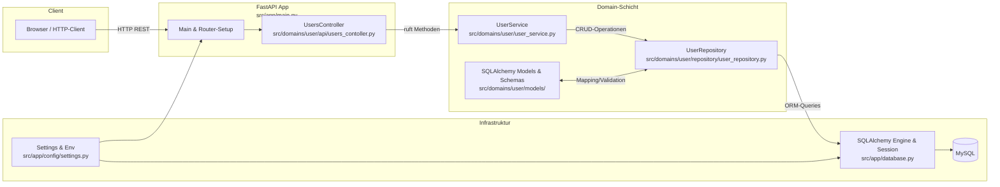
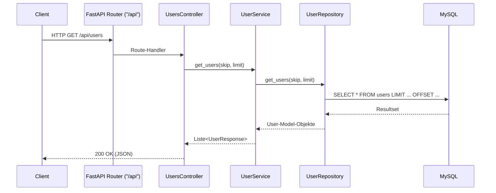

# User Service mit FastAPI und MySQL


`uvicorn src.app.main:app --reload`

## Environment Variables
```
# Database Configuration
DB_HOST=localhost
DB_PORT=3306
DB_USER=root
DB_PASSWORD="xxx"
DB_NAME=user_service_db

# API Configuration
API_HOST=0.0.0.0
API_PORT=8000
DEBUG=true
```


## Architekturübersicht

Nachfolgend findest du eine visuelle Übersicht der Architektur dieses User-Services. Die Diagramme sind in Mermaid geschrieben und werden auf GitHub automatisch gerendert.

### Komponenten-/Datenflussdiagramm


### Sequenzdiagramm: Beispiel GET /api/users


### Schichten & Verantwortlichkeiten (kurz)
- API/Controller: Endpunkte definieren, Request/Response binden, Fehler in HTTP-Status übersetzen.
- Service: Geschäftslogik, Validierungen (z. B. E-Mail/Username-Kollisionen), Aggregation.
- Repository: Datenzugriff via SQLAlchemy (Sessions, Queries, Transaktionen).
- Modelle/Schemas: Persistenz-Modelle (ORM) und Pydantic-Schemas für IO.
- Infrastruktur: App-Start, DB-Engine/Session, Konfiguration aus Umgebungsvariablen.
